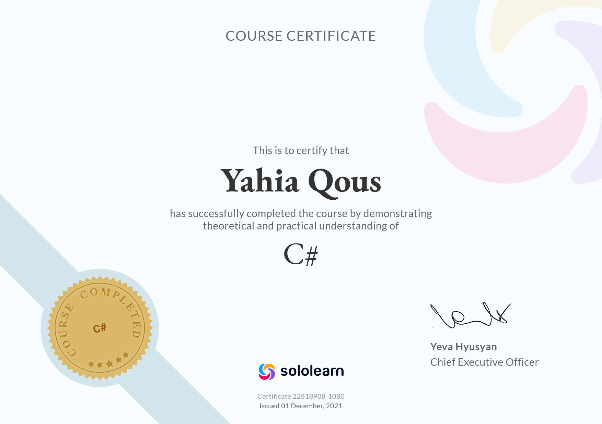

<!-- @format -->

# Welcome to C#

This is a brief of learning C# Language from [SoloLearn](https://www.sololearn.com/learning/1080)

C# is an elegant object-oriented language that enables developers to build a variety of secure and robust applications that run on the .NET Framework.

- Windows applications
- Web services
- Mobile applications
- Client-server applications
- Database applications ...etc

## The .NET Framework

Consists of:

- Common Language Runtime (CLR): the foundation of the .NET Framework
  - Manages code at execution time
  - Providing core services such as
    - Memory management
    - Code accuracy ...etc
- The .NET Framework class library: A collection of classes, interfaces, and value types that enable you to accomplish a range of common programming tasks, such as:
  - Data collection
  - File access
  - Working with text

## Start Coding

To create a new app: **dotnet new console -o PROJECTNAME**

To run the app: **dotnet run**

## Certificate

